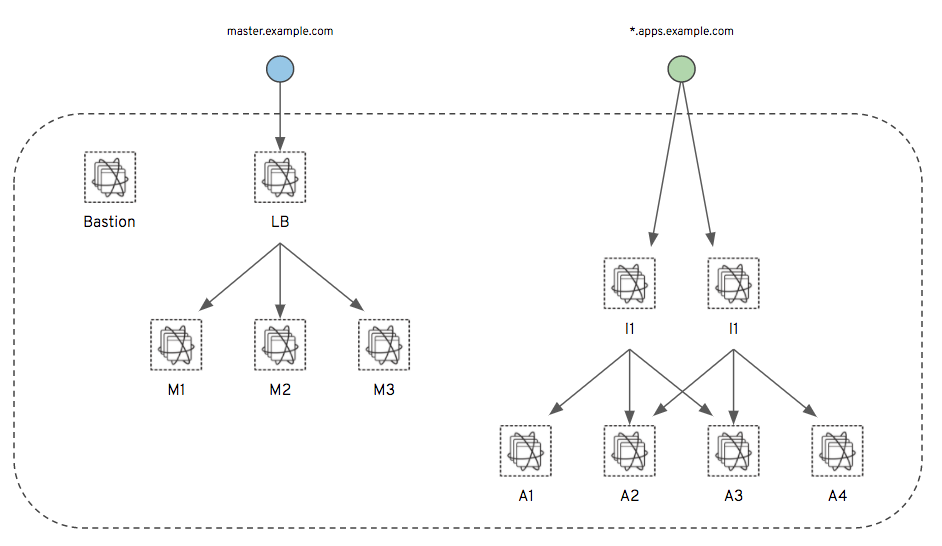

# ansible-aws-cluster-openshift

This repository contains [Ansible](https://www.ansible.com/) roles and
playbooks to install simple [OpenShift](https://www.openshift.com/) clusters on AWS.

The following cluster types are supported:

* Small - 1 Master Node, 1 .. n App Nodes
* Medium - 1 Master Node, 1 Infra Node, 1 .. n App Nodes
* Large - 3 Master Nodes, 2 Infra Nodes, 1 Load Balancer, 3 .. n App Nodes
* Single Developer - A OpenShift installation on a single EC2 instance. (COMING SOON).

The playbooks create the AWS infrastructure to support above cluster types before installing OpenShift itself.

## Where do I start?

In order to provision a cluster, a couple of items have to be in place:

1) AWS account credentials must be present (aws_access_key, aws_secret_key). See [My Security Credentials](https://console.aws.amazon.com/iam/home#/security_credential).
2) In order to route traffic to the cluster, you need a public zone file and domain configured in [AWS Route53](https://console.aws.amazon.com/route53/home).
3) Create a SSH key file in the [AWS EC2 console](https://console.aws.amazon.com/ec2/v2/home?#KeyPairs:sort=keyName), and place the public key file in e.g. `~/.ssh`. 
4) Prepare your `inventory file` by making a copy of e.g. `inventory/inventory_small.example`.
5) Modify your inventory file to match your needs.
6) Created a pre-built AMI to speed in the provisioning of the clusters.


### TL;DR - Let's Provision!

**WARNING:** Running the following plays will provision items in your AWS account, and you may incur billing charges. These plays are not suitable for the AWS free-tier.

More details on each step can be found in later sections ... let's provision a cluster !

#### Step 1 - Prepare the Inventory

Make a copy of e.g. `inventory/inventory_small.example` and give it a unique name: `inventory/inventory_eu_west`. 

At minimum, the following variables MUST be changed:

```yaml
vars:
  # AWS access key
  aws_access_key: AKI...
  aws_secret_key: 7te...
  # The AWS region to deploy to
  region: eu-west-1
  # AWS keyname and local keyfile location
  key_name: openshift
  ansible_ssh_private_key_file: ~/.ssh/openshift.pem
  # Public DNS zone setup
  namespace: openshift
  public_dns_zone: example.com
```

Changing all other variables is OPTIONAL. More configuration options can be found in file `playbooks/group_vars/all`.

#### Step 2 - Create the AMI

Start the creation of the pre-built AMI:

```shell
ansible-playbook -i inventory/<your_inventory_file> playbooks/build_ami.yml
```

#### Step 3 - Create the Cluster

Run the main playbook to create the infrastructure and then create the cluster:

```shell
ansible-playbook -i inventory/<your_inventory_file> playbooks/provision.yml
```

The creation of a large cluster (Infrastructure and OpenShift) will take aproximately 45 minutes.

#### Step 4 - Access the Cluster

Once the provisioning tasks are done, you can access the cluster via it's public hostname, e.g:  

https://master.openshift.example.com:8443  

When prompted for a username and password, simply choose any username/password combination, the cluster will accept them. To change this behaviour, modify the inventory templates in `roles/prepare_inventories/files`.


## DANGERZONE

### Stop the Cluster and de-provision the infrastructure

**WARNING:** Running the teardown plays will DESTROY ALL DATA in the cluster!

Remove the OpenShift cluster:

```shell
ansible-playbook -i inventory/<your_inventory_file> playbooks/deprovision.yml
```

## Configuration

#### Cluster Types

The playbooks support the following types of clusters:

* Small - 1 Master Node, 1 .. n App Nodes
* Medium - 1 Master Node, 1 Infra Node, 1 .. n App Nodes
* Large - 3 Master Nodes, 2 Infra Nodes, 1 Load Balancer, 3 .. n App Nodes

The type of cluster that will be provisioned depends on the following variables in your inventory file:

```yaml
vars:
  # Cluster size
  master_nodes: 1
  infra_nodes: 0
  app_nodes: 1
```

The following rules define the cluster type:

| master_nodes | infra_nodes | app_nodes | Cluster Type |
|--------------|-------------|-----------|--------------|
|      1       |      0      |  1 .. n   |  SMALL       |
|      1       |      > 0    |  1 .. n   |  MEDIUM      |
|      3       |      2 ..   |  3 .. n   |  LARGE       |

#### Spot Instances

By default, EC2 Spot Instances are used. The maximum amount to bid can be set in your inventory:

```yaml
vars:
  # EC2 instance configuration
  bastion_spot_price: 0.04
  infra_node_spot_price: 0.10
  app_node_spot_price: 0.10
```

To disable spot instances, simply remove their bid price:

```yaml
vars:
  # EC2 instance configuration
  bastion_spot_price:
  infra_node_spot_price:
  app_node_spot_price:
```

## Cluster Topology

TBD



## What is next?

The following improvements are on the to-do list:

- More plays to maintain the cluster e.g. start/stop of the cluster or add app nodes
- Merge repo [majordomusio/ansible-aws-oc-openshift](https://github.com/majordomusio/ansible-aws-oc-openshift) with this one to support an *all-in-one* cluster installation.
- Support for EC2 Elastic Loadbalancers instead of the HAProxy Loadbalancer fronting the master nodes.
- Same for infra nodes
- Use Let's Encrypt to create certificates for the apps deployed on the cluster
- Add Gluster support back in
- Alternative user authentication methods

## Contributing

All pull requests are welcome !

